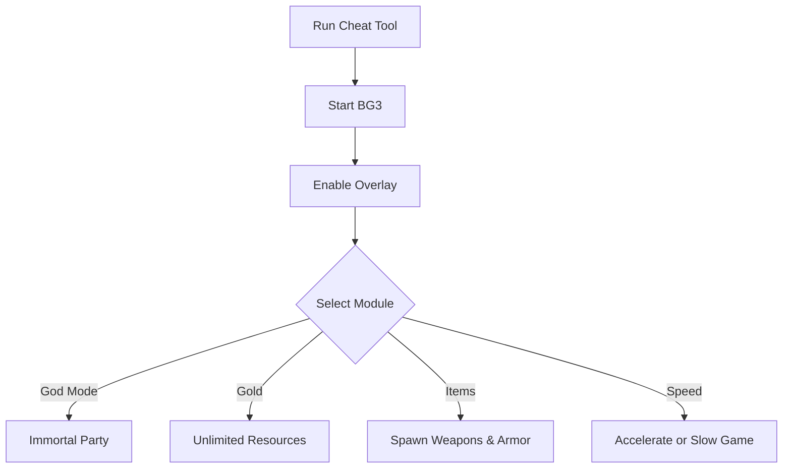

# Baldur’s Gate 3 Cheat 🐉

The **Baldur’s Gate 3 Cheat Software** is designed for players who want to explore Faerûn without limits. With an easy-to-use overlay menu, hotkey toggles, and full customization, it allows you to **manage resources, boost combat power, and experiment with builds** on your own terms.

[](#)
[](#)
[](#)
[](#)

---

## 📝 Overview

Baldur’s Gate 3 offers deep role-playing, tactical combat, and endless choices—but sometimes you want to push beyond restrictions. This cheat tool adds **god mode, gold, inventory control, and speed adjustments**, making it perfect for **sandbox sessions, build testing, or story exploration**.

\[!NOTE]
The cheat runs in memory only. It does not alter save data permanently.

---

## ⭐ Features

* **God Mode** – Survive any encounter without losing HP.
* **Unlimited Gold** – Buy equipment and supplies freely.
* **Item Spawner** – Add weapons, armor, and consumables instantly.
* **Party Control** – Modify stats, XP, and abilities.
* **Game Speed Toggle** – Accelerate or slow time for testing.
* **Overlay Menu** – Control cheats live in-game.

---

## 🖥 Compatibility

| Platform      | Supported | Notes                 |
| ------------- | --------- | --------------------- |
| Windows 10/11 | ✅         | Fully supported       |
| Steam         | ✅         | Stable overlay builds |
| GOG           | ✅         | Compatible            |
| macOS         | ⚠️        | Limited support       |
| Consoles      | ❌         | Not supported         |

\[!IMPORTANT]
Accessibility: Overlay supports high-contrast mode, font scaling, and simplified layouts.

---

## ⚡ Setup Guide

1. **Download** the Baldur’s Gate 3 Cheat package.
2. Extract files into your BG3 root folder.
3. Run `BG3_Cheat.exe` as administrator.
4. Launch the game and press `F1` to open the cheat overlay.
5. Use the in-game menu or config file to adjust settings.

```ini
[cheat]
godmode=true
gold=999999
speed=1.5x
xp_boost=on
hotkey_overlay=F1
hotkey_godmode=F2
```

---

## 🔄 Cheat Workflow



---

## ❓ FAQ

**Q: Will cheats affect story progression?**
A: No, the core narrative and quests remain intact.

**Q: Can I toggle features mid-game?**
A: Yes, hotkeys and overlay options allow instant control.

**Q: Does this overwrite my save files?**
A: No, all changes are temporary unless you choose to save with them active.

**Q: Can I use this in multiplayer?**
A: No, this is built for **offline single-player use** only.

**Q: Does it reduce FPS?**
A: No, the overlay is lightweight and optimized.

---

## 🚀 Final Thoughts

The **Baldur’s Gate 3 Cheat Software** gives you the power to **experiment, explore, and enjoy Faerûn on your own terms**. From infinite gold to god mode, it’s a versatile tool for anyone who wants a more flexible RPG experience.

---


